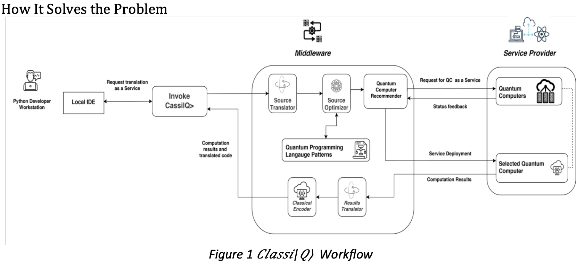
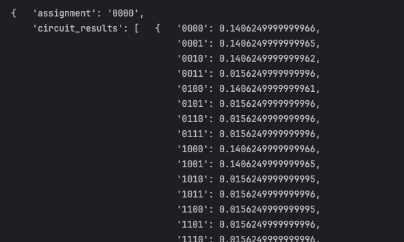
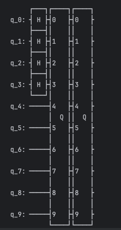

# Classi|Q> Project!!!
Trying to bridge the gap between classical computing and quantum computing, especially in the context of **NP-complete problem**, for those who are not familiar with quantum computing. This project is addressing both a theoretical and practical need


## License
This project takes Qiskit open source project as a reference, thanks to community.
A copy of this license is included in the `LICENSE` file.

## Attribution
- Qiskit: https://qiskit.org/
- License: http://www.apache.org/licenses/LICENSE-2.0
- Author: Boshuai Ye, email: boshuaiye@gmail.com
### Workflow of Classi|Q>


### How we translate classical problem into quantum???
We aim to analyze the given classical code by extracting its Abstract Syntax Tree (AST), traversing it to identify the type of problem being solved, and then capturing the original data. 
The next step is to convert this input data into a format suitable for 
quantum computation. Currently, we are focusing on converting NP problems 
to CNF (Conjunctive Normal Form) and utilizing the Quantum Approximate 
Optimization Algorithm (QAOA). For these cases, oracles tailored to 
different types of problems will be required. And also a translator that gives readable output.

### Limitedness
1. ***Inherent complexity to translate original problem into CNF***...
2. ***Not all problems have a quantum counterpart...*** 

### Translating Classical Problems into Quantum

1. **Problem Formulation and Data Representation**
   - **Classical**: We aim to analyze the given classical code by extracting its Abstract Syntax Tree (AST), traversing it to identify the type of problem being solved and fetching input data
   - **Quantum**: Convert input data into quantum format (with qubits)
2. **Algorithm Selection**
   - **Classical**: Choose an appropriate classical algorithm (e.g., sorting, searching, optimization).
   - **Quantum**: Identify or design a quantum algorithm (e.g., Grover's algorithm for searching, Shor's algorithm for factoring) that can solve the problem more efficiently using quantum principles.
3. **State Initialization**
   - **Classical**: Initialize the data in a particular state or configuration.
   - **Quantum**: Prepare an initial quantum state, often starting from |0⟩, |1⟩, or a superposition state.
4. **Circuit Design**
   - **Classical**: Some parts of the algorithm are ran classically, for example: gradient decent in QAOA
   - **Quantum**: Design a quantum circuit that implements the quantum algorithm. This involves choosing quantum gates (e.g., Hadamard, CNOT, T-gate) that manipulate qubits according to the problem’s requirements. This part is automated.
5. **Execution**
   - **Local**: Run the circuit with local simulator
   - **Quantum**: Execute the quantum circuit on a remote quantum computer.
6. **Interpretation of Results**
   - **Quantum**: Interpret the measured quantum state to understand the solution. 

### What I am trying to do first
- **Basic arithmetic operation**: +, -, *, / are implemented with quantum unitary gates
- **Graph problems**: perhaps easy to understand
  - qaoa (partially done based on openqaoa)
    - Visualization
    - Support different file format e.g., gset, tsplib 
  - grover (oracle for each problem needed)
    - Convert it to SAT problem if it could be done.
    - Why **Sat**? Sat problem was the first problem proven to be NP-complete by Stephen Cook in 1971 (Cook’s theorem). This means that every problem in NP can be           reduced to SAT, making it a kind of "universal" problem for NP. Any problem in NP can be reduced to it in polynomial time. So study SAT counterpart of a graph problem has an empirical implication.
    - How to choose an optimal iterations number wisely? We suppose the number of solutions is unknown, The formula for updating T is given by: choose T=1 initially, then T = ceil(4\5 T) each iteration[^1]
- **Parser**
  - Try to make sure your code contains only a single function, only one usage at once. And also try to make code structure clear and names of variables and functions clearly indicates its usages. This tree-based parser is not that clever yet (based mainly on rules)... I am thinking to employ OPENAI interfaces later... 
- **Generator**
   - Based on results from parser and select corresponding algorithms... 
- **Interpreter**

# Example
## Maximum Independent Set
### Code
```python 
independent_set_code = """
import itertools

def is_independent_set(graph, subset):
    # Check if the subset is an independent set
    for i in range(len(subset)):
        for j in range(i + 1, len(subset)):
            if graph[subset[i]][subset[j]] == 1:
                return False
    return True

def find_max_independent_set(graph):
    n = len(graph)
    nodes = list(range(n))
    max_independent_set = []

    # Check all possible subsets
    for size in range(1, n + 1):
        for subset in itertools.combinations(nodes, size):
            if is_independent_set(graph, subset):
                if len(subset) > len(max_independent_set):
                    max_independent_set = subset

    return max_independent_set

# Example usage:
# Adjacency matrix representation of the graph
graph = [
    [0, 1, 0, 0, 0],
    [1, 0, 1, 1, 0],
    [0, 1, 0, 0, 1],
    [0, 1, 0, 0, 1],
    [0, 0, 1, 1, 0]
]

max_independent_set = find_max_independent_set(graph)
print("Maximum Independent Set:", max_independent_set)
"""
parser.parse_code(independent_set_code)
print(parser.problem_type, parser.specific_graph_problem, parser.data)
generator = QASMGenerator()
qasm_code = generator.qasm_generate(classical_code=independent_set_code, verbose=False)
print(qasm_code)
```

### Results
#### Grover algorithm generated


#### QAOA generated


[^1]: Boyer, M., Brassard, G., Høyer, P., & Tapp, A. (1998). Tight bounds on quantum searching. Fortschritte Der Physik, 46(4–5), 493–505. https://doi.org/10.1002/(sici)1521-3978(199806)46:4/5


